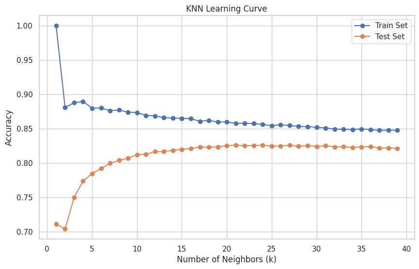

# Road Safety Analysis

This project aims to **identify the severity of road accidents** based on given crash data in Queensland, Australia. By analyzing the data, we strive to **minimize accident rates** and **maximize public safety** by providing insights and actionable recommendations.

---

## Project Overview

- **Target Variable**: `Crash_Severity` (categorical).
- **Objective**: Analyze crash data to predict accident severity, identify patterns, and derive actionable insights for improving public safety.

---

## Dataset Description

**Dataset**: `crash_data_queensland_1_crash_locations.csv` 

The dataset provides detailed information on road accidents in Queensland. Below is the structure of the dataset:

| **Column Name**                 | **Description**                                                                 |
|---------------------------------|---------------------------------------------------------------------------------|
| `Crash_Ref_Number`              | Unique identifier for each crash.                                               |
| `Crash_Severity`                | The severity of the crash (target variable). Categories include: `Minor injury`, `Fatal`, `Property damage only`, `Hospitalisation`, `Medical treatment`. |
| `Crash_Year`                    | Year of the crash.                                                              |
| `Crash_Month`                   | Month of the crash.                                                             |
| `Crash_Day_Of_Week`             | Day of the week when the crash occurred.                                         |
| `Crash_Hour`                    | Hour of the day when the crash occurred.                                        |
| `Crash_Nature`                  | Nature of the crash (e.g., `Angle`, `Rear-end`).                                |
| `Crash_Type`                    | Type of crash (e.g., single-vehicle, multi-vehicle).                            |
| `Crash_Latitude` and `Longitude`| Geographical location of the crash.                                             |
| `Crash_Street`                  | Name of the street where the crash occurred.                                    |
| `Crash_Speed_Limit`             | Speed limit in the area of the crash.                                           |
| `Crash_Road_Surface_Condition`  | Surface condition of the road at the time of the crash.                         |
| `Crash_Atmospheric_Condition`   | Weather conditions during the crash.                                            |
| `Count_Casualty_*`              | Number of casualties in different severity categories (e.g., fatalities, hospitalizations). |
| `Count_Unit_*`                  | Number of vehicles and pedestrians involved.                                    |

---

## Tools and Libraries

- **Libraries**: `pandas`, `numpy`, `matplotlib`, `sweetviz`.  
- **Visualization**: Heatmaps, histograms, pie charts, and bar graphs.  
- **Modeling**: Logistic Regression, KNN, Decision Tree, Random Forest.  

---

## Exploratory Data Analysis (EDA)

EDA was conducted using **`pandas`**, **`matplotlib`**, and **`sweetviz`**. Key findings include:

### Summary Statistics

1. **Total Accidents**: 374,214  
2. **Total Injuries**: 287,678  
3. **Property Damage Only**: 86,536 cases  
**Sweetviz Analysis**: Comprehensive visual report of the dataset is stored in [**EDA.html**](./EDA.html).  

---

### Insights from EDA

#### Crash Severity Distribution

- Most crashes resulted in **medical treatment** or **hospitalization**.
-   
- Fatalities accounted for only **0.901%** of crashes.  
-  

#### Year-wise Accident Trends

- Accident rates declined in recent years.  
- The highest accident rates occurred between **2000 and 2010**, averaging 22,508 accidents annually.  
-  

#### Time Distribution

- Accidents occurred evenly across months.
-   
- The majority of accidents occurred between **3 PM and 5 PM**, averaging **30,330 accidents**.  
-  

#### Street-wise Accident Distribution

- **Top Streets**: Bruce Highway (highest), Gold Coast Hwy (second highest).  
- Focus should be on improving safety measures on these high-risk roads.
-  

#### Nature of Crashes

- **Top Three Crash Natures**:  
  - **Angle Accidents**: 111,049 cases.
  - When two vehicles collide at an angle, often at intersections.
  - **Rear-End Collisions**: 92,892 cases.
  - When a vehicle collides with the rear of another vehicle. 
  - **Hit Object**: 81,644 cases.
  - When a vehicle collides with a stationary object, such as a barrier, pole, or tree.
- 

#### Crash Types

- Most of the crashes occurred are multi-vehicle with total pedestrian accidents at 16,635.
-   

#### Lighting and Weather Conditions

- Most accidents occurred during the day under clear weather conditions.  
- 
- Therefore, visibility or weather has not been the main cause for accidents

#### Speed Limit Impact

- Majority of crashes occurred at a speed limit of **60 km/h**.
- 
- Lower speedlimits resulted in lesser number of accidents

#### Roadway feature Impact

- Majority of crashes occurred at **Intersections**.
- 
- More rules should be imposed on intersections, to prevent crashes and ensure safe transportation
- A detailed examination of intersection with crash severity shows that medical treatment has the highest count in intersection and  hospitalisation is next.
- 
  
#### Lockdown Impact Analysis

- Analyzed crashes during the lockdown period (2020-01-01 to 2021-04-01).  
- **Findings**: Significant reduction in both accident frequency and severity during the lockdown compared to pre- and post-lockdown periods.  
- 


#### Spatial Characteristics

- A **heatmap** was created to analyze the spatial distribution of accidents based on latitude and longitude.
- 
- Most of the crashes occur along the coast

#### Pedestrian Crashes

- Analyzed crashes involving pedestrians by roadway features, time, and age groups.
- **Distribution of Pedestrian crashes based on Roadway features**
- 
- Most of the pedestrian crashes occur at intersections, suggesting a stringent road crossing rule to be implemented.
- **Distribution of Pedestrian crashes by hour**
- 
- Most of the pedestrian crashes occur around 3PM
- **Distribution of Pedestrian crashes by age**
- 
- The pedestrian crashes decrease with age, with 0-16 having the most crashes and 75+ the least
- Suggested measures include enhancing street lighting, increasing pedestrian safety education, and implementing traffic calming measures for road crossing.  
  

---

## Data Preprocessing

### Handling Missing Values

- Missing values were replaced using the **KNN Imputer**.

### Feature Selection

- Dropped columns with:
  - **Low Correlation** (< 0.15) with the target variable.  
  - **High Variance Inflation Factor (VIF)** (> 5).
  - `Crash_Year`, `Crash_Hour`, `Count_Casualty_Fatality`, `Count_Unit_Motorcycle_Moped`, `Count_Unit_Truck`, `Count_Unit_Bus`, `Count_Unit_Bicycle`, `Count_Unit_Other`
 

### Dimensionality Reduction

- Heatmap was drawn and high correlation was found between (`Count_Casualty_Total` and `Count_Casualty_MedicallyTreated`) and (`Crash_Latitude` and `Crash_Longitude`)
- These columns were combined using **PCA**.
- 

### Label Encoding

- Categorical columns were encoded using **LabelEncoder**.

### Feature Scaling

- Numerical columns were scaled between 0 and 1 using a **Standard Scaler**.

---

## Model Building

### Data Splitting

- **Training Set**: 60%  
- **Validation Set**: 20%  
- **Test Set**: 20%  

### Models

#### Logistic Regression

- **Test Accuracy**: 99.98%
- We cannot induce the logic behind the model for classification, so we try KNN

#### K-Nearest Neighbors (KNN)

- Used the **elbow method** to determine the optimal value of `k`.
- 
- The accuracy flatlines after 0.8 with k = 20
- **Test Accuracy**: 80% at `k=20`.
- The learning curve of the KNN model with training and test data is drawn
- 
- The accuracy of the model does not improve beyond .82 after k=20
- Observations: KNN is sensitive to noise, and crash data is inherently noisy, limiting its performance.

#### Decision Tree

- **Parameters**: `max_depth=10` `criterion=gini` `minimum samples to split=300` `minimum samples in leaf=100` `alpha=.0026`
- **Validation Accuracy**: 99.19%  
- **Feature Importance**: Visualized feature contributions to the model.
- 
- Conducted **hyperparameter tuning** to find the optimal **ccp_alpha** value:
  - The various parameters are modelled to observe the changes in impurity and size of the tree with alpha to identify the ideal alpha to prune the decision tree
  - **Gini impurity VS Alpha**
  - 
  - **Tree size VS Alpha**
  - 
  - **Accuracy VS Alpha**
  - 
  - The accuracy does not differ significantly between training and test sets meaning the model has generalised well.
  - Selected **alpha = 0.0026** for the best trade-off between bias and variance and minimal difference in accuracy between training and test dataset
  - **The final decision tree**:
  - 

#### Random Forest
- **Parameters**: `max_depth=10` `criterion=gini` `minimum samples to split=300` `minimum samples in leaf=100`
- **Validation Accuracy**: 97.61%  

---

### Model Selection

The **Decision Tree** was selected as the final model due to its high accuracy and ability to generalize well to unseen data.

---

## How to Run

### **Pre-requisites**:
1. Install the required libraries:
   ```bash
   pip install pandas numpy matplotlib sklearn sweetviz

---


## Conclusions

1. **Key Observations**:
   - Medical treatment and hospitalization are the most common crash outcomes.  
   - Accidents are more frequent at **intersections** and during **afternoon hours**.  
   - High-risk streets and suburbs were identified for targeted interventions.  

2. **Recommendations**:
   - Install traffic calming measures and traffic police in high-risk areas.
   - Improve the road traffic flow at intersections with better infrastructures to avoid crashes 
   - Focus safety campaigns on peak accident times and locations.  
   - Improve pedestrian safety through better infrastructure and education to young people.  

This comprehensive analysis provides valuable insights into road safety, helping authorities prioritize areas for intervention and policy-making.


